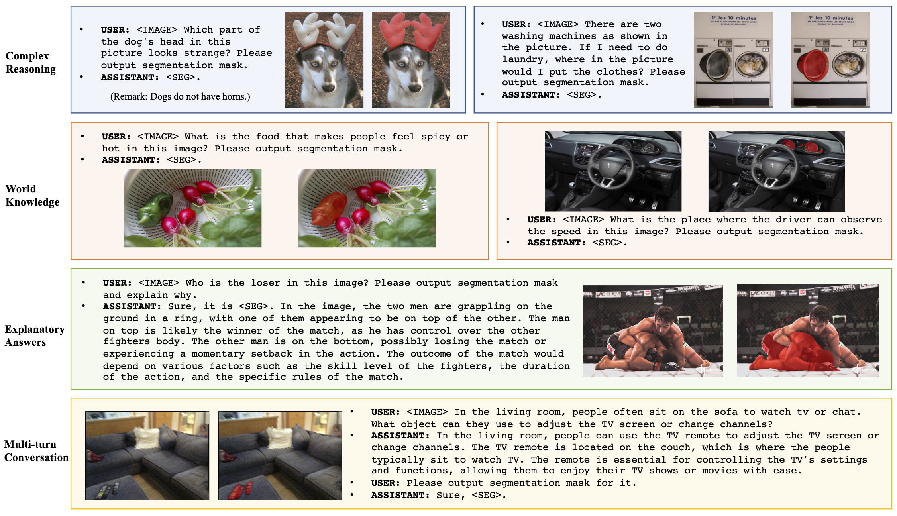
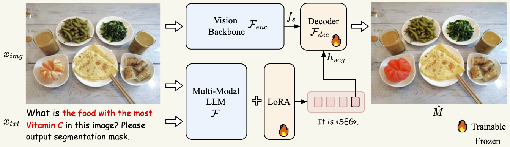

# LISA: Reasoning Segmentation Via Large Language Model

This is the official implementation of ***LISA(large Language Instructed Segmentation Assistant)***. 

<p align="center">  </p>

## News
- [x] [2023.8.2] Paper is released and github repo is created.

## TODO 
- [ ] Huggingface Demo
- [ ] ReasonSeg Dataset Release
- [ ] Codes and models Release

## Abstract
In this work, we propose a new segmentation task --- ***reasoning segmentation***. The task is designed to output a segmentation mask given a complex and implicit query text. We establish a benchmark comprising over one thousand image-instruction pairs, incorporating intricate reasoning and world knowledge for evaluation purposes. Finally, we present LISA: Large-language Instructed Segmentation Assistant, which inherits the language generation capabilities of the multi-modal Large Language Model (LLM) while also possessing the ability to produce segmentation masks.
For more details, please refer to:

**LISA: Reasoning Segmentation Via Large Language Model [[Paper](https://arxiv.org/pdf/2308.00692.pdf)]** <br />
[Xin Lai](https://scholar.google.com/citations?user=tqNDPA4AAAAJ&hl=zh-CN),
[Zhuotao Tian](https://scholar.google.com/citations?user=mEjhz-IAAAAJ&hl=en),
[Yukang Chen](https://scholar.google.com/citations?user=6p0ygKUAAAAJ&hl=en),
[Yanwei Li](https://scholar.google.com/citations?user=I-UCPPcAAAAJ&hl=zh-CN),
[Yuhui Yuan](https://scholar.google.com/citations?user=PzyvzksAAAAJ&hl=en),
[Shu Liu](https://scholar.google.com.hk/citations?user=BUEDUFkAAAAJ&hl=zh-CN),
[Jiaya Jia](https://scholar.google.com/citations?user=XPAkzTEAAAAJ&hl=en)<br />

<p align="center">  </p>

## Highlights
**LISA** unlocks the new segmentation capabilities of multi-modal LLMs, and can handle cases involving: 
1. complex reasoning; 
2. world knowledge; 
3. explanatory answers; 
4. multi-turn conversation. 

**LISA** also demonstrates robust zero-shot capability when trained exclusively on reasoning-free datasets. In addition, fine-tuning the model with merely 239 reasoning segmentation image-instruction pairs results in further performance enhancement.

## Experimental results
<p align="center">  </p>

## Citation 
If you find this project useful in your research, please consider citing:

```
@article{reason-seg,
  title={LISA: Reasoning Segmentation Via Large Language Model},
  author={Xin Lai and Zhuotao Tian and Yukang Chen and Yanwei Li and Yuhui Yuan and Shu Liu and Jiaya Jia},
  journal={arXiv:},
  year={2023}
}

```

## Acknowledgement
-  This work is built upon the [LLaMA](https://github.com/facebookresearch/llama), [SAM](https://github.com/facebookresearch/segment-anything), and [LLaVA](https://github.com/haotian-liu/LLaVA). 
